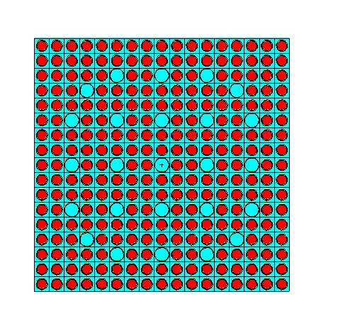

# Comparative Analysis of UO₂ Enrichment Levels in AP1000 Pressurized Water Reactors (PWR)

## Introduction
This project examines the impact of varying UO₂ enrichment levels on a AP1000 Pressurized Water Reactor (PWR) using the Monte Carlo N-Particle (MCNP) simulation tool. We analyzed three different enrichments of U-235 in UO₂ (2.1%, 2.6%, and 3.1%) to observe differences in key reactor parameters, such as reactivity (k-eff), prompt neutron removal lifetime, and source entropy growth. This study provides insights into the relationship between enrichment level, reactor stability, and fuel cycle duration, which are critical factors in optimizing fuel performance and management.

## Project Conditions and Setup
- **Reactor Type**: PWR with an 8x8 lattice geometry.
- **Enrichment Levels**: UO₂ fuel at 2.1%, 2.6%, and 3.1% U-235 enrichment.
- **Key Parameters**:
  - **K-eff Calculation**: Assessed for criticality and stability.
  - **Prompt Neutron Removal Lifetime**: Analyzed for stability and reactivity.
  - **Source Entropy Growth**: Monitored for distribution uniformity.
  - **Cross-Sections and Temperature**: ENDF/B-VII.0 cross-sections at 600K.

## Comparative Analysis of Enrichment Levels

The table below compares critical performance metrics across the three enrichment levels.

| **Aspect**                     | **2.1% Enrichment**                                          | **2.6% Enrichment**                                     | **3.1% Enrichment**                                      |
|--------------------------------|--------------------------------------------------------------|---------------------------------------------------------|----------------------------------------------------------|
| **Fuel Composition**           | Lowest U-235 concentration; limited reactivity               | Moderate U-235; balanced reactivity                     | Highest U-235 concentration; strong reactivity           |
| **Initial Reactivity (k-eff)** | Lower, often subcritical; stable over time                   | Near-critical; maintains stability                      | Higher, initially supercritical; requires control        |
| **Stability Over Cycles**      | Stabilizes slowly, consistent k-eff                          | Moderate stability; good balance                        | Stabilizes quickly, needs active control                 |
| **Source Entropy Growth**      | Slow, fewer mesh expansions required                        | Moderate growth; gradual Z-axis expansion               | Rapid growth; frequent Z-axis mesh expansion             |
| **Prompt Neutron Removal Lifetime** | Long (2700–2800 μs); slower interactions            | Intermediate (2370–2450 μs); balanced                  | Short (2000–2100 μs); faster interactions                |
| **Fuel Cycle Impact**          | Longer cycle, slower burnup; ideal for longevity             | Balanced cycle and burnup rate                          | Shorter cycle, higher burnup; high power density         |
| **Control Requirements**       | Easier to control, stable reactivity                         | Moderate control, manageable fluctuations               | Demands active control due to high initial reactivity    |

## Detailed Comparison and Insights

1. **Reactivity (K-eff) and Stability Over Cycles**:
   - **2.1% Enrichment**: Lower k-eff, requiring more time to reach criticality, with high stability over cycles and slower burnup rate, ideal for longevity-focused operations.
   - **2.6% Enrichment**: Achieves a balanced k-eff, maintaining criticality without excess reactivity; ideal for steady power production with manageable control.
   - **3.1% Enrichment**: Highest k-eff with quick stabilization; provides high power density but requires active control for safety.

2. **Source Entropy and Distribution**:
   - **2.1% Enrichment**: Slower entropy growth; neutron population density spreads gradually.
   - **2.6% Enrichment**: Moderate entropy growth, achieving uniform distribution more quickly.
   - **3.1% Enrichment**: Rapid entropy growth, achieving uniform fission distribution quickly, necessitating more frequent control.

3. **Prompt Neutron Removal Lifetime**:
   - **2.1% Enrichment**: Longest removal lifetime (2700–2800 μs), indicating a stable neutron interaction rate.
   - **2.6% Enrichment**: Intermediate lifetime (2370–2450 μs), balancing interaction rate with stability.
   - **3.1% Enrichment**: Shortest lifetime (2000–2100 μs), reflecting high neutron density and requiring additional control.

4. **Fuel Cycle Impact and Operational Requirements**:
   - **2.1% Enrichment**: Suitable for longer cycles with stable reactivity, reducing refueling needs.
   - **2.6% Enrichment**: Balanced cycle length and power output; ideal for reactors prioritizing efficiency.
   - **3.1% Enrichment**: Shorter fuel cycle with high power output, suitable for high-demand reactors but requires rigorous control.

## Conclusion
This comparative analysis reveals the trade-offs in using 2.1%, 2.6%, and 3.1% UO₂ enrichment levels:
- **2.1% Enrichment**: Emphasizes fuel longevity and stability, suited for reactors with low power demands.
- **2.6% Enrichment**: Balances power output with moderate burnup, providing stable operation.
- **3.1% Enrichment**: Maximizes power density and fuel burnup, suited for high-demand applications with active control.

This study supports informed fuel design and operational decisions to optimize reactor performance and safety in PWR applications.
